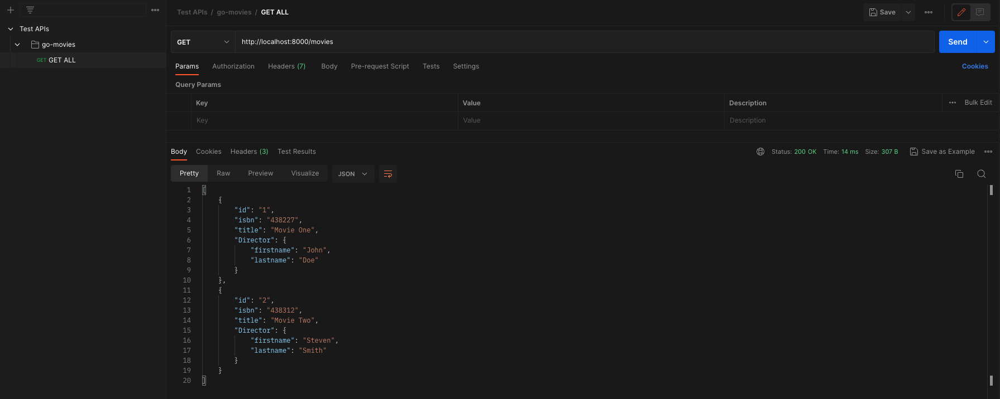
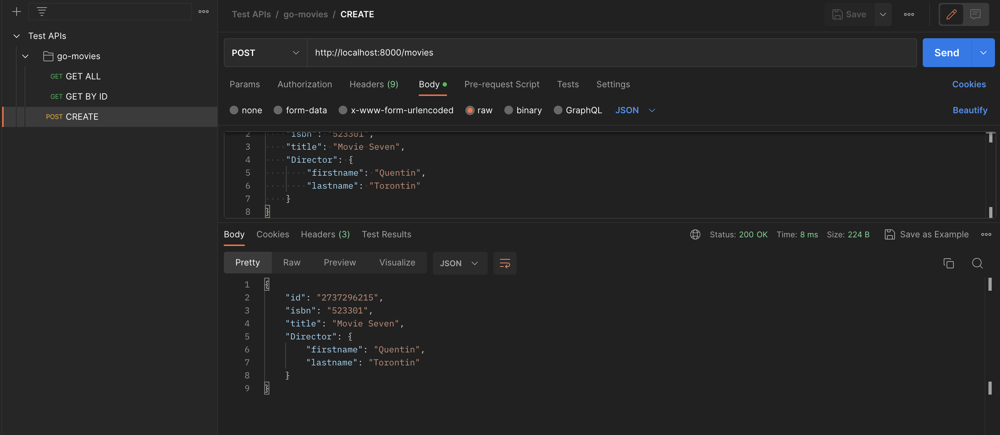
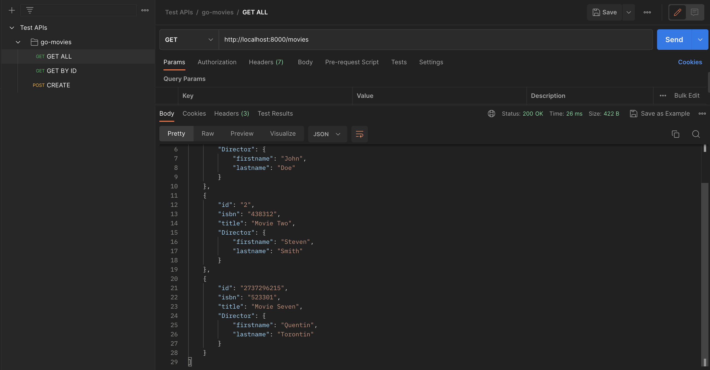
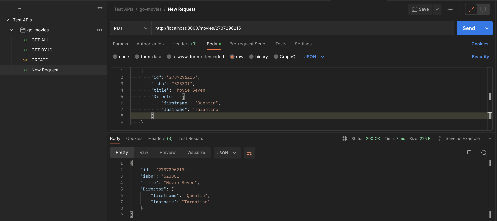
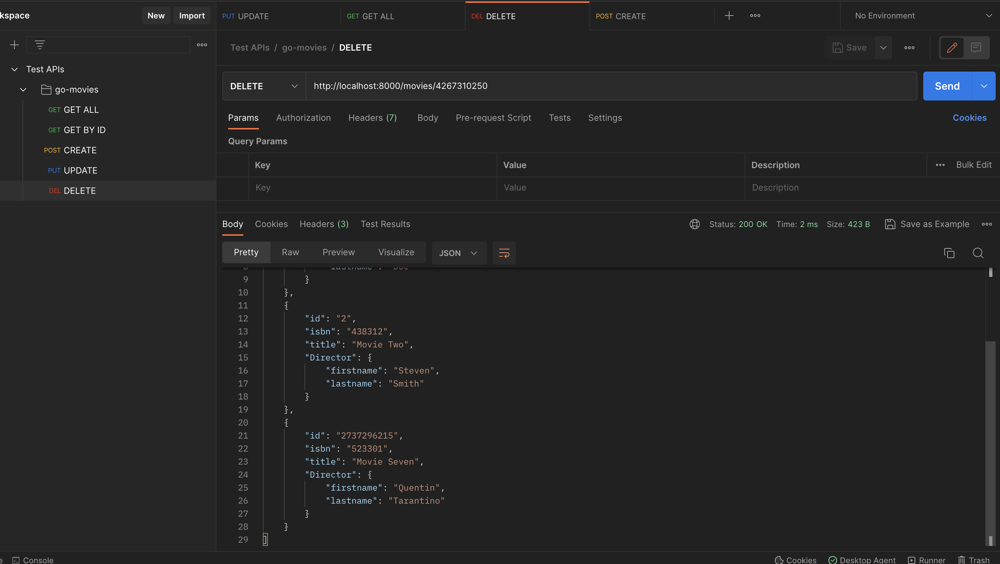

# Go CRUD API Basic Project

In this repo I've put the code for a simple CRUD API made with Golang. All the code is within the main.go file and there's no frontend, however I've tested it with POSTMAN API calls:

## GET ALL

A screenshot from postman after sending a GET ALL get request:

## CREATE

A screenshot from postman after sending a CREATE get request:

A screenshot of GET_ALL after creating with the earlier request:

As you can see, there's a new entry.

## UPDATE

A screenshot from postman after sending a UPDATE put request:

The value for the director has been changed.

## DELETE

A screenshot from postman after sending a DELETE del request:

Any entry with an ID in the request would be deleted.

## Final Thoughts

This is my first project in Go.
This repo was created while watching a tutorial about Go:
[Learn Go Programming](https://www.youtube.com/watch?v=jFfo23yIWac)
